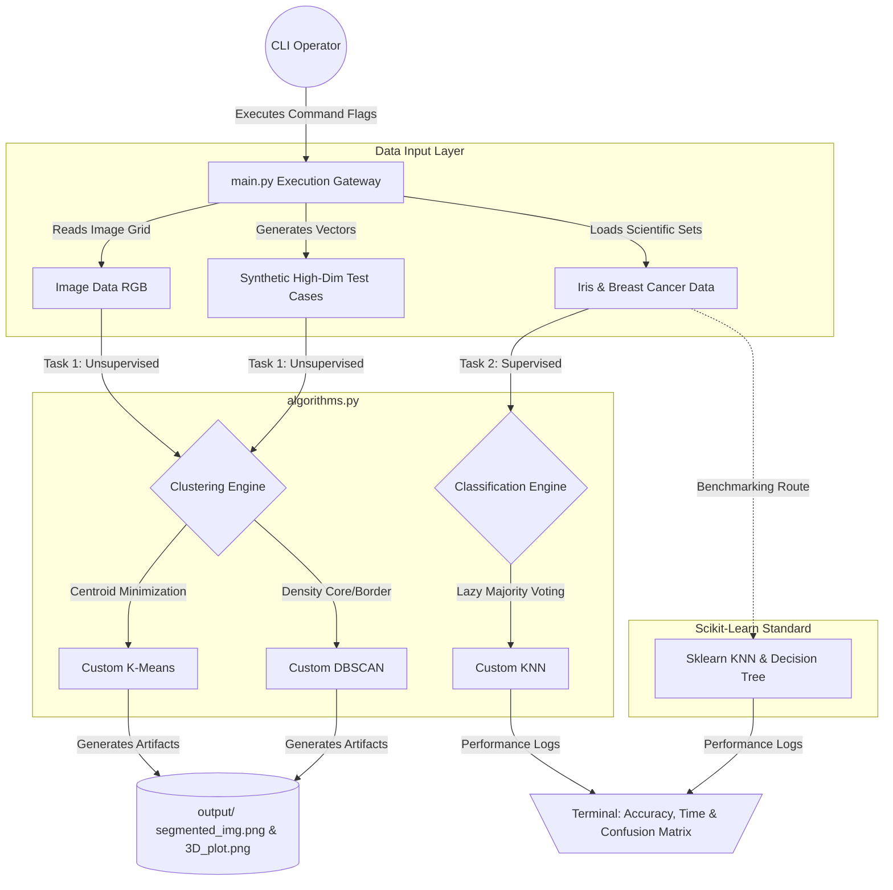

# Custom ML Clustering & Classification Toolbox

A modular, high-performance Python implementation of core unsupervised and supervised machine learning algorithms engineered from scratch. This project features K-Means and DBSCAN for 3D image segmentation and high-dimensional data clustering, alongside K-Nearest Neighbors (KNN) and Decision Tree models for scientific data classification. The system features a flexible Command Line Interface (CLI) to benchmark custom algorithmic logic directly against industry-standard Scikit-Learn implementations.

---

## 🔗 System Components
* 🧮 [Algorithms Module](./algorithms.py): From-scratch mathematical core logic for KMeans, DBSCAN, and KNN.
* 🖥️ [Main Execution Gateway](./main.py): Centrally manages data flows, parameters, and testing routines.
* 🧪 [Universal Test Suite](./test_data_task_1/test_kmeans.py): Validation script confirming high-dimensional metric compliance.

---

## 🏗️ System Architecture Flow



---

## ✨ Key Features

* **Algorithmic Autonomy:** Zero reliance on high-level ML libraries for core calculations; distance calculations, voting, and cluster updates are handled natively.
* **Multi-Metric Flexibility:** Built-in distance evaluation parameters supporting **Euclidean**, **Manhattan**, and **Maximum (Chebyshev)** mathematical spaces.
* **Universal High-Dimensional Support:** Capable of mapping and processing coordinates past human visualization limits, validated explicitly up to 5D and 30D array spaces.
* **Dynamic Benchmarking Matrix:** Outputs granular execution runtime (training vs. prediction latency) and comprehensive accuracy profiles to systematically contrast custom performance against Scikit-Learn.
* **Visual Data Compression:** Transforms continuous raw RGB camera inputs into distinct, compressed categorical color segments (posterization).

---

## 🛠️ Tech Stack

* **Language:** Python 3.12+
* **Numerical Processing:** NumPy (Vectorized array calculations)
* **Imaging Suite:** Pillow (PIL Wrapper for pixel data extraction)
* **Data Visualization:** Matplotlib (3D scatter plotting engine)
* **Evaluation Framework:** Scikit-Learn (Used strictly for secondary control benchmarking metrics)

---

## 🚀 Getting Started

### 1. Clone the repository:

```bash
git clone <your-repository-url>
cd <repository-folder-name>

```

### 2. Configure Environment & Dependencies:

Ensure you have the required foundational libraries installed before launching runtime operations:

```bash
pip install numpy pillow matplotlib scikit-learn

```

### 3. Run Commands (CLI Execution Examples):

* **Task 1 - Image Color Segmentation (K-Means with 6 clusters):**
```bash
python main.py --task 1 --algo kmeans --k 6 --dist euclidean

```


* **Task 1 - Density-Based Segmentation (DBSCAN over custom image file):**
```bash
python main.py --task 1 --algo dbscan --eps 12.0 --min_samples 20 --file your_photo.jpg

```


* **Task 1 - High-Dimensional Math Verification (5D Test Run):**
```bash
python main.py --task 1 --algo kmeans --test_file test_data_task_1/test_kmeans.py

```


* **Task 2 - Classification Matrix and Benchmark Execution:**
```bash
python main.py --task 2 --algo knn --dist manhattan

```


---

## 🧩 Core Architecture Modules

* **`algorithms.py`:** Contains the structural code implementations for `KMeans`, `DBSCAN`, and `KNNClassifier` classes, incorporating manual matrix distance broadcasting.
* **`main.py`:** Parses user arguments, coordinates dataset loading, executes pipeline timing sequences, and routes structured matrix exports.
* **`utils/`:** Helper utilities managing custom directory formations, image file conversions, and internet connection safety checks for asset acquisitions.
* **`output/`:** Unified local repository where resulting 3D pixel scatter clouds, original data frames, and compressed image segments are stored.
